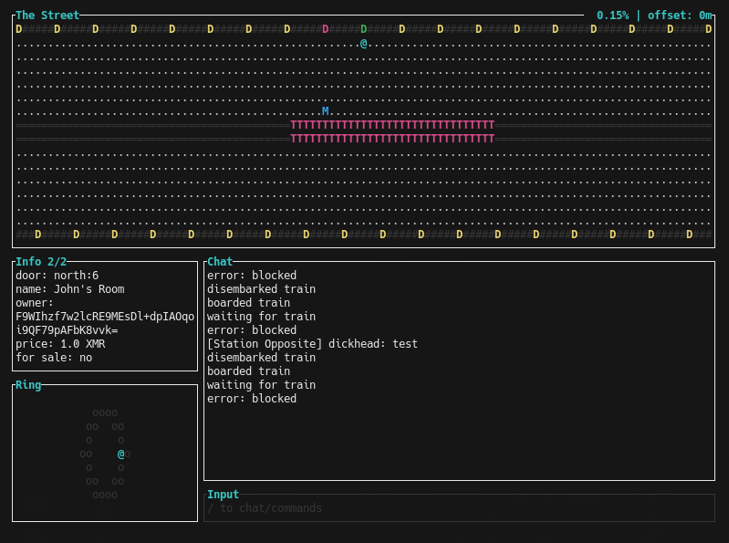

# The Street

Terminal-first social world inspired by Snow Crash. Walk the ring, chat by proximity, buy rooms, and ride the monorail. The MVP is a Rust WebSocket relay with a TUI client.



## What it is

- A single authoritative relay server (no federation).
- An ASCII world: a ring-shaped street, rooms behind doors, and a fast monorail.
- A local-chat experience: talk to nearby players or whisper at close range.
- An economy prototype with mock XMR balances behind a wallet interface.

## Tech at a glance

- Rust workspace with separate crates for `client`, `relay`, `protocol`, `world`, and shared `common` types.
- WebSocket relay that owns world state and persists data on the server.
- TUI client for rendering, input, and network messaging.
- Signed client actions using a persistent keypair (ed25519).
- Tor/SOCKS5 support (optional for dev).

## Quick start (dev)

1. Start the relay:

```bash
cargo run -p street-relay -- --config config/relay.toml
```

2. Start the client:

```bash
cargo run -p street-client -- --config config/client.toml
```

3. Optional second local client:

```bash
cargo run -p street-client -- --config config/client2.toml
```

## Configuration

- Relay config: `config/relay.toml`
- Client config: `config/client.toml`
- Client identity key: `config/identity.key` (auto-generated on first run)

Running the client without `--config` will create `config/client.toml` and a new identity key using the default relay `ws://89.125.209.155:9001`.

For multiple local clients, each needs a unique `identity_key_path`. Use `config/client2.toml` as a template.

## Controls

- Move: arrow keys or WASD
- Input: press `/` for commands, Enter to type chat, Tab to cycle chat modes
- Info: press `i` to cycle info panels
- Quit: Esc or Ctrl+Q

## Commands

- Chat: `/say <msg>`, `/whisper <user> <msg>`
- Presence: `/who`
- Rooms: `/buy`, `/room_name <name>`, `/door_color <color>`, `/access <open|whitelist|blacklist> [user|pubkey...]`, `/access show`
- Identity: `/claim_name <name>`
- Economy: `/pay <user> <amount>`, `/balance`, `/faucet [amount]`
- Monorail: `/board <north|east|south|west>`, `/depart <north|east|south|west>`
- Help: `/help`, `/exit`

## World model (MVP)

- The street is an infinite ASCII ring with doors every few columns.
- Rooms are separate maps with ownership and access controls.
- The monorail runs through the center of the street; stations are marked with `M`.
- Movement is grid-based with wall collisions.

## Networking

- Relay is a WebSocket server; the client connects via `relay_url`.
- Tor/SOCKS5 can be enabled with `tor_enabled = true` and `socks5_proxy`.
- For LAN play, bind the relay to `0.0.0.0:9001` and point clients at your IP.

## Project layout

- `crates/common`: shared types, config, crypto helpers
- `crates/protocol`: message types, serialization, signature verification
- `crates/world`: map generation, physics, doors
- `crates/wallet`: wallet trait and mock implementation
- `crates/relay`: WebSocket server, authoritative state, persistence
- `crates/client`: TUI, input handling, networking, rendering

## Notes

- The wallet and XMR integration are mocked in the MVP.
- The relay never stores private keys.

## Docs

- Protocol: `docs/PROTOCOL.md`
- Data model: `docs/DATA_MODEL.md`
- Workspace: `docs/WORKSPACE.md`
