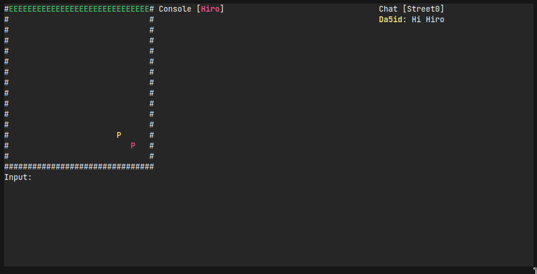

# The Street

I began this project on 25.01.2024 at work. Inspiration was of course from Neal Stephenson's Snow Crash.

Would like to implement the following features:
- [ ] Ability for users to engage in one-on-one or multi-user chats
- [ ] Anonymity and privacy features such as TOR connectivity and end-to-end encryption
- [ ] Integration with cryptocurrencies such as XMR for sending money
- [ ] Ability for users to set up their own property on the street

Whole lot of work to do before that, it's only day one.
